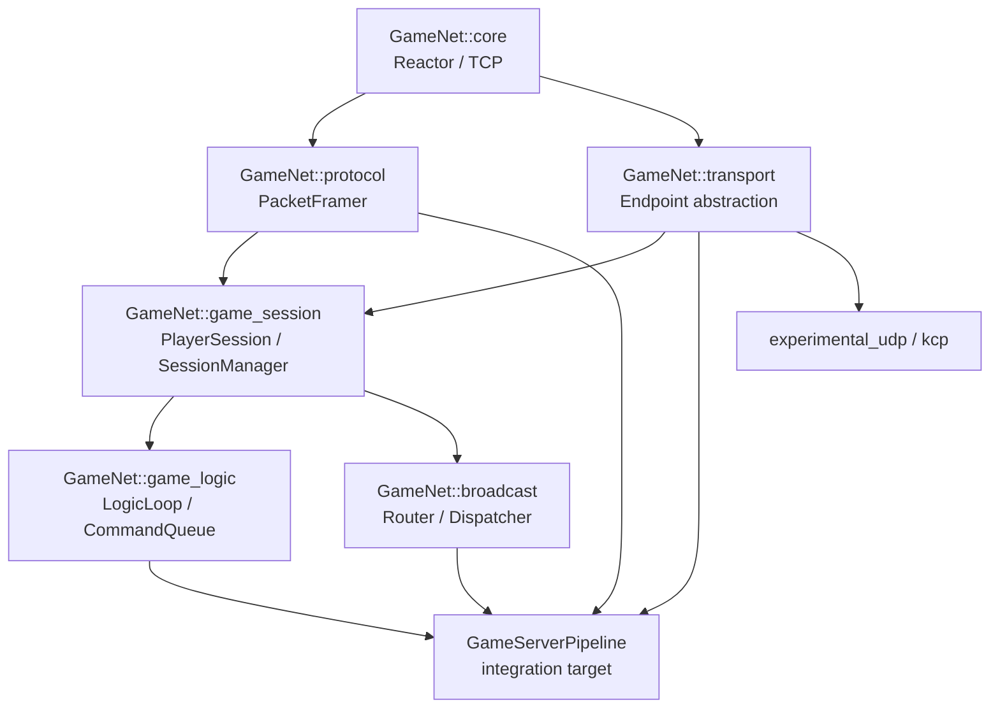

## 总体结论

截至 PR [#2](https://github.com/YanqingXu/game-net-core/pull/2) 的已验证候选提交 [`a7fd77c`](https://github.com/YanqingXu/game-net-core/commit/a7fd77cbd2140041cebb3f900d5c609fafc2adad)，`game-net-core` 已经完成了“可运行的 Reactor/TCP 网络库”阶段，并具备发布跨平台核心预览版所需的 CI、长稳和性能证据。

我的阶段判断是：

> Phase 1～3 基本完成，目前仍处于 Phase 3.5：线程契约、生命周期、CI、长稳测试和 Windows IOCP 收口。Phase 4 尚未正式开始。

按不同口径估算：

| 评估口径             |      当前进度 | 判断                         |
| ---------------- | --------: | -------------------------- |
| Reactor/TCP 功能实现 |   90%～95% | 主链路完整                      |
| Core 工程化成熟度      |   90% 左右 | 远端证据已闭环；待合并 PR 并发布 Core Preview 标签 |
| 完整游戏网络底座愿景       |     约 40% | 协议、会话、逻辑桥、广播尚未迁移           |
| 生产可用程度           | 仍不建议宣称生产级 | 正确性证据较强，但性能、长稳、优雅停服仍不足     |

## 当前实现进度

| 模块                           | 状态       | 评价                                                |
| ---------------------------- | -------- | ------------------------------------------------- |
| CMake、安装和包导出                 | 已完成      | 已导出 `GameNet::core`，支持 `find_package`             |
| EventLoop / Channel / Poller | 已完成并持续硬化 | Linux epoll 与 Windows IOCP 均有实现                   |
| TimerQueue / Wakeup          | 已完成      | 已覆盖线程与取消竞态                                        |
| Acceptor / Connector         | 已完成      | ConnectEx、retry-stop 等高风险路径已有测试                   |
| TcpConnection                | 主体完成     | read/write/close、pending IO cancellation 已覆盖      |
| TcpServer / TcpClient        | 主体完成     | 多线程 stop、retry、重复调用、跨线程调用已有契约                     |
| EventLoopThreadPool          | 已完成      | 有 restart/stop/queued-work 测试                     |
| Windows IOCP                 | 功能可用     | `AcceptEx/ConnectEx/WSARecv/WSASend` 已进入真实数据路径    |
| 测试体系                         | 较完整      | 当前记录为 67 个 CTest：7 unit、59 contract、1 integration |
| CI                           | 已建立      | Linux Debug、ASan/UBSan、TSan、Release、Windows MSVC  |
| 长稳测试                         | 已达当前门禁   | `a7fd77c` 已完成远端 46-test × 50，2300 次执行全部通过 |
| 协议及游戏层                       | 未实现      | 仅保留 intent，符合当前 scope 约束                          |

核心目标和边界在 [README](https://github.com/YanqingXu/game-net-core/blob/main/README.md)、[migration_status.md](https://github.com/YanqingXu/game-net-core/blob/main/docs/migration_status.md) 和 [scope_boundary.md](https://github.com/YanqingXu/game-net-core/blob/main/docs/scope_boundary.md) 中保持得比较清楚。

## 当前最重要的未闭环问题

### P0：验证证据已闭环，等待合并和发布标签

PR #2 的核心候选提交是 `a7fd77cbd2140041cebb3f900d5c609fafc2adad`，验证文档继续使用不可自指的证据模型：

* `ci` run [`29076601085`](https://github.com/YanqingXu/game-net-core/actions/runs/29076601085)（#27）在同一 SHA 上通过 Linux Debug、ASan/UBSan、TSan、Release 和 Windows MSVC IOCP 五个 job
* `long-soak` run [`29077148022`](https://github.com/YanqingXu/game-net-core/actions/runs/29077148022) 使用 `--repeat until-fail:50 --timeout 60`，46/46 threading tests 全部通过，CTest 实际耗时 1632.47 秒
* `core-benchmark` run [`29077151229`](https://github.com/YanqingXu/game-net-core/actions/runs/29077151229) 在同一 SHA 上产出 Linux epoll 与 Windows IOCP Release artifacts，8 份 JSON 均为 `gamenet.core_benchmark.v1` 且 `status=ok`
* #26 暴露的 repeated-connect 失败已由 generation-tagged 请求准入修复；本地 Debug/Release 全量、46-test threading repeat-5 和单契约 repeat-50 也全部通过

因此，Phase 3.5 的技术证据门禁已经满足；Phase 4 仍需等待 PR #2 合并和 `v0.1.0-core-preview` 标签发布，避免在未冻结的候选分支上扩展 scope。

这里的文档模型已经从“Current HEAD”改为只记录：

```text
Last validated commit
CI run id
long-soak run id
验证日期
测试数量与结果
```

后续继续避免使用自指式的 `Current HEAD` 字段。

### P0：TcpConnection 公共状态查询线程契约已通过远端 TSan

当前 worktree 已将 `TcpConnection::state_` 改为 `std::atomic<StateE>`，`connected()` / `disconnected()` 成为可跨线程调用的 snapshot observer，并新增 `contract.tcp_connection.test_tcp_connection_cross_thread_state` 验证非 owner 线程观察 connect/close 状态转换。

同时，`setTcpNoDelay()`、callback setters、context access、`connectEstablished()`、`connectDestroyed()` 继续被明确为 owner-loop-only；`TcpServer` 也已调整为在连接 owner loop 上安装 callback 后再 establishment。

`ci` #27 的 Linux TSan race-oriented job 已在候选提交 `a7fd77c` 上完整通过，普通 Linux、ASan/UBSan、Release 与 Windows IOCP job 也验证了同一 SHA。

### P1：Linux/Windows 同 SHA 性能基线已建立

当前 worktree 已新增默认关闭的 `gamenet_core_benchmark`，覆盖：

* 每连接内存占用
* 单线程吞吐和延迟
* 多 EventLoop 扩展效率
* 慢客户端和输出堆积下的内存上限

manual `core-benchmark` workflow 已在 `a7fd77c` 上产出 Linux epoll 与 Windows IOCP 的 Release artifacts，覆盖 `echo` / `connections` / `slow-client` 三个场景。当前证据是可审计快照，不是跨平台性能阈值；IOCP 单次 completion 与未来批量 drain 的对比仍是后续性能议题。

### P1：历史 intent 存在迁移语义漂移

当前 worktree 已给全部 formal intent 加上 front matter，并由 `tests/scope/test_intent_metadata.py` 强制 active / deferred / legacy 分类。这个问题的剩余部分从“缺少元数据”变成“持续维护分类准确性”。

其中 active intent 必须指向 `GameNet::core`；deferred 和 legacy intent 不能授权实现，只能作为设计资产。统一元数据形态为：

```yaml
status: active | deferred | legacy
target: GameNet::core
migration_source: mini_trantor
promote_gate: phase-4-protocol
```

## 推荐依赖关系



依赖原则：

* `core` 永远不能反向依赖协议、会话或游戏层。
* `protocol` 只负责字节流到帧，不负责玩家和业务语义。
* `transport` 只抽象发送、关闭和 endpoint 身份，不解析协议。
* `SessionManager` 管理网络会话，不拥有玩家业务数据。
* `LogicLoop` 不依赖 `TcpConnection`，只处理值类型命令。
* `GameServerPipeline` 先作为组合层和集成示例，不要立即变成“大一统核心类”。
* UDP/KCP 实现 transport 接口，但必须继续保持 experimental。

## 按优先级排序的架构路线图

### P0：完成 Phase 3.5，发布 Core Preview

目标：把当前 Reactor/TCP 核心冻结成稳定基线。

完成条件：

* [x] 同一个候选提交上五个 CI job 全绿。
* [x] 当前 46 个 threading tests 完成远端 `repeat 50`。
* [x] `TcpConnection` 状态查询线程契约通过远端 CI / TSan。
* [x] 明确 Logger、自定义 callback、Socket option 的线程语义。
* [x] 清理验证文档的自指 HEAD 问题。
* [ ] 合并 PR #2 并打标签 `v0.1.0-core-preview`。

### P1：PacketFramer——Phase 4 唯一正确入口

新增 `GameNet::protocol`，但第一版只实现长度帧：

```text
uint32 length | payload
```

不要一开始就把 `messageId/requestId/playerId` 塞进 PacketFramer。建议分成：

* `PacketFramer`：处理半包、粘包、长度校验。
* `GamePacketHeader`：处理 messageId、requestId、flags。
* `Codec`：负责对象序列化，后续可接 Protobuf、自定义二进制或 Lua。

验收测试：

* 半包
* 多帧粘包
* 空帧
* 超大帧
* 恶意长度
* 分段输入
* fuzz smoke
* Linux/Windows 一致结果

### P2：最小 Transport Endpoint

新增 `GameNet::transport`：

* `TransportSessionId`
* `TransportEndpoint`
* `send(bytes)`
* `close(reason)`
* `ownerLoop()`
* TCP adapter

第一版不要创建庞大的 `TransportManager`，因为目前只有 TCP。等 UDP/KCP 真正进入时再增加 transport registry。

### P2：Session Foundation

新增：

* `PlayerSession`
* `SessionManager`
* `SessionState`
* transport/session 双向索引
* authenticate、online、offline、rebind
* idle timeout 与 heartbeat 状态

关键约束：

* SessionManager 由明确的 base/management loop 拥有。
* I/O loop 只能异步提交，不允许通过 `future.get()` 等待 LogicLoop。
* Session 只保存网络身份和生命周期，不保存背包、战斗、地图等业务状态。

### P2：LogicLoop 和有界命令队列

新增：

* `GameCommand`
* `GameCommandQueue`
* `LogicLoop`
* 固定 tick drain
* 有界队列与显式 submit result

必须保证：

```text
I/O EventLoop -> enqueue command -> LogicLoop
```

禁止退化为：

```text
I/O EventLoop -> 同步执行游戏逻辑
```

### P3：跑通第一个 GameServerPipeline

最小闭环：

```text
TCP bytes
→ PacketFramer
→ auth/session
→ GameCommandQueue
→ LogicLoop handler
→ response
→ TransportEndpoint
```

先把它放在 `examples/game_server_pipeline_demo` 和 integration tests 中。只有当边界稳定后，才考虑提升成正式 library target。

### P3：Broadcast 与全链路背压

在 SessionManager 稳定后实现：

* `BroadcastRouter`
* `BroadcastDispatcher`
* 按 owner loop 批量派发
* fanout 数量和字节预算
* 低优先级丢弃策略
* 显式 metrics reason

AOI、房间和世界状态必须由上层提供目标 session 列表，不能进入 broadcast 核心。

### P4：扩展模块

推荐顺序：

1. coroutine bridge，严格复用 EventLoop 调度。
2. TLS transport adapter。
3. UDP transport。
4. KCP preview。
5. HTTP/WebSocket/RPC adapter。
6. PMTU/FEC 研究模块。

其中 UDP/KCP/PMTU 必须保持独立 experimental target，不能重新侵入 `GameNet::core`。

## 可执行开发计划

| 周期    | PR    | 核心交付物                             | 验收标准                                 |
| ----- | ----- | --------------------------------- | ------------------------------------ |
| 已完成   | PR-0A | CI evidence、文档证据模型、当前 long-soak   | 五个 CI job 同 SHA 全绿；46 threading × 50 |
| 已完成   | PR-0B | TcpConnection 公共 API 线程契约         | 跨线程状态查询契约与远端 TSan 均通过                 |
| 已完成   | PR-0C | core benchmark 基线                 | Linux/Windows 均输出吞吐、P99、内存数据         |
| 3～5 天 | PR-1  | PacketFramer intent、target、tests  | 半包/粘包/恶意长度/fuzz 全绿                   |
| 3～5 天 | PR-2  | TransportEndpoint + TCP adapter   | 不改变 TcpConnection 生命周期语义             |
| 4～6 天 | PR-3  | PlayerSession + SessionManager    | reconnect、重复登录、断线清理契约通过              |
| 4～6 天 | PR-4  | LogicLoop + bounded command queue | I/O 线程无同步等待；过载可观测                    |
| 3～5 天 | PR-5  | Pipeline demo + integration tests | 登录、请求、响应、断线完整闭环                      |
| 3～5 天 | PR-6  | Broadcast + backpressure metrics  | 大 fanout 分批；无跨线程直接 send              |
| 后续    | PR-7+ | coroutine/TLS/UDP/KCP             | 每个模块独立 target 和独立成熟度标签               |

最关键的路线判断没有改变：现在不要迁移 HTTP、RPC、KCP 或完整 GameServerPipeline。先合并已完成证据收口的 PR #2 并发布 Core Preview 标签，然后只从 PacketFramer 切入 Phase 4。这条路线最稳，也最符合你把 `game-net-core` 做成“可长期演进的游戏服务器网络底座”，而不是第二个失控膨胀的 `mini_trantor` 的目标。
