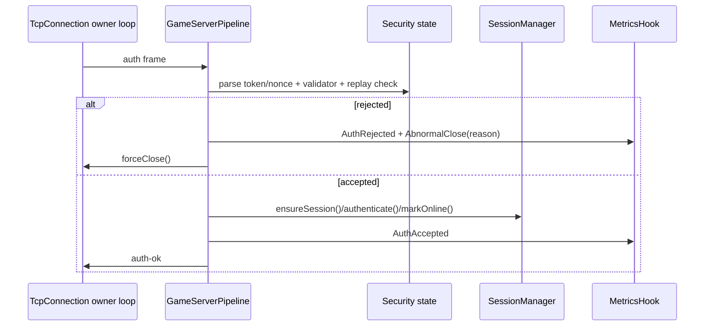

# Module Intent: Game Gateway Security

## 1. Intent

Game gateway security defines the first admission guard for game clients before
their frames enter session, logic, or broadcast paths.

It is intentionally small: it validates the auth handshake payload, blocks
connect-auth replay within a short window, applies a per-session frame-rate
budget, and emits explicit close/reject metrics.

It is not a full account-security system. Account lookup, ban lists, risk
scoring, encryption policy, and anti-cheat remain upper-layer concerns.

---

## 2. Responsibilities

- define gateway-level auth token and nonce policy
- allow an injected auth token validator while preserving EventLoop semantics
- reject replayed auth nonces within the configured replay window
- apply per-session frame-rate limits after authentication
- close offending connections through the normal `TcpConnection::forceClose()`
  path
- emit security metrics for auth accepts, auth rejects, rate limits, and
  abnormal closes
- keep default behavior compatible with legacy `payload == sessionToken` auth

---

## 3. Non-Responsibilities

- does not implement password, account, platform, or payment authentication
- does not implement TLS or protocol encryption
- does not store sensitive auth secrets beyond short-lived replay keys
- does not mutate `PlayerSession` directly
- does not execute game business logic on I/O threads
- does not bypass `SessionManager` ownership or reconnect semantics
- does not replace `GameBackpressureOptions`

---

## 4. Core Invariants

- Default options are valid and disabled.
- Disabled security does not split auth payloads on the nonce delimiter.
- Replay protection uses `(sessionToken, nonce)`; a fresh nonce must still allow
  the same session token to reconnect within sticky-session semantics.
- Security decisions that close a connection must emit an observable reason.
- Per-session frame-rate counters are shared across I/O loops and protected by
  an explicit mutex.
- Replay/rate mutable state belongs to `GameServerPipeline`, not to
  `TcpConnection`, `SessionManager`, or `LogicLoop`.
- Security callbacks are admission observers/validators; they must not become a
  hidden scheduler or business state owner.

---

## 5. Threading Rules

- Auth frame parsing and rate-limit enforcement run on the connection owner loop.
- Replay and rate maps are shared by all connection owner loops in one pipeline
  and are protected by `securityMutex_`.
- `AuthTokenValidator` is copied under lock, then executed on the connection
  owner loop.
- Security metrics are emitted synchronously on the owner loop that observed the
  event.
- Cross-thread mutation of validator/metric callback goes through setter locks.

---

## 6. Ownership Rules

- `GameSecurityOptions` is value-type configuration owned by
  `GameServerPipeline::Options`.
- `GameServerPipeline` owns replay/rate cache state.
- `SessionManager` remains the owner of `PlayerSession` objects and transport
  indexes.
- `TcpConnection` owns socket state and close mechanics; security only requests
  `forceClose()`.
- `MetricsHookRecorder` may observe security events through exporter callbacks
  but does not own pipeline/session/connection objects.

---

## 7. Failure Semantics

- Empty auth token, empty replay nonce, oversized auth payload, validator
  rejection, replay, and session creation failure reject auth and close.
- A non-auth frame before authentication is an abnormal close.
- Invalid framed input is an abnormal close.
- Per-session rate overflow emits `RateLimited`, then `AbnormalClose`.
- Replay cache entries expire after `authReplayWindow`.
- Rate counters reset when `sessionRateWindow` rolls over and old entries are
  pruned opportunistically.

---

## 8. Lifecycle Sequence

---

## 9. Extension Points

- `GameSecurityOptions::maxAuthTokenBytes`
- `GameSecurityOptions::authReplayWindow`
- `GameSecurityOptions::authTokenNonceDelimiter`
- `GameSecurityOptions::maxFramesPerSessionPerWindow`
- `GameSecurityOptions::sessionRateWindow`
- `GameServerPipeline::setAuthTokenValidator`
- `GameServerPipeline::setSecurityMetricCallback`
- `MetricsHookRecorder::makeGameSecurityCallback`

---

## 10. Test Contracts

- default security preserves legacy auth payload as the full session token
- replay protection rejects the same `(sessionToken, nonce)` within the window
- replay protection allows the same session token with a fresh nonce
- validator rejection closes the connection and emits a security reason
- authenticated per-session frame overflow closes the connection and emits a
  rate-limit reason
- metrics exporter records security event and reason counters

---

## 11. Review Checklist

- Does the change preserve default auth compatibility?
- Does every close-causing security decision emit a reason metric?
- Is replay keyed by token and nonce, not token alone?
- Does the code avoid mutating `SessionManager` state outside manager APIs?
- Are validator and metrics callbacks documented as lightweight owner-loop
  callbacks?
- Which test file verifies the changed contract?
