# Module Intent: KcpTransport / KcpSession

## Intent

`KcpTransport` provides a lightweight KCP-style reliable transport preview on top of UDP while
preserving mini-trantor's EventLoop ownership model.

The module is intentionally small: it validates the reactor-compatible shape of reliable datagram
transport before a full production KCP stack is introduced.

## Responsibilities

- Own one UDP socket on one owner `EventLoop`.
- Maintain session-id to `KcpSession` mappings.
- Encode/decode KCP-style frames with session, seq, ack, flags, and payload.
- Deliver data payloads once, in order, despite duplicate or out-of-order frames.
- Split application payloads that exceed a fixed safe UDP payload size into reliable fragments.
- Reassemble fragments on the owner loop and deliver one complete application payload upward.
- Track in-flight outbound data frames and retransmit them on owner-loop flush ticks.
- Use selective ACK payloads to confirm out-of-order packets without changing in-order delivery.
- Expose conservative retry/RTO tuning options without moving state outside the owner loop.
- Optionally probe a larger per-session UDP payload size with owner-loop MTU control frames
  and enter blackhole cooldown while keeping the current safe size when probes fail.
- Optionally reuse confirmed MTU probe results and blackhole cooldowns through a
  transport-local path cache keyed by peer address, or through an explicitly injected
  thread-safe in-process `transport::PathMtuCache` shared by multiple transports.
- Optionally consume an explicit path MTU failure signal, downgrade the peer flow to a safe
  datagram payload size, and carry that cooldown through the transport-local path cache.
- Optionally enable platform path MTU signals through the UDP PMTU signal adapter
  and local `EMSGSIZE`, then feed them into the same owner-loop failure path.
- Optionally enable the UDP socket's Linux IPv4/IPv6 raw ICMP Packet Too Big
  listener and feed matching signals into the same owner-loop failure path.
- Optionally authenticate raw ICMP PMTU signals by requiring the quoted UDP
  payload prefix to look like a KCP frame for the active peer session id before
  applying a safe-size downgrade.
- Optionally cap reliable data in-flight frames with a per-session owner-loop congestion
  window and drain queued frames as ACKs arrive.
- Optionally send bounded redundant copies for newly sent reliable data frames to cover
  first-transmission loss without waiting for RTO.
- Optionally emit bounded XOR parity frames for small reliable data groups and recover
  one missing packet per group without bypassing in-order delivery.
- Close sessions that exceed the configured retransmission retry budget.
- Detach externally held sessions on transport stop.

## Non-Responsibilities

- No production-grade congestion control algorithm or production KCP window tuning.
- No cross-platform raw ICMP source, cryptographic ICMP authentication,
  disk-persistent PMTU database, distributed path MTU service, or hidden global cache. Cross-transport
  sharing is limited to an explicitly injected in-process `transport::PathMtuCache`.
- No full parity/FEC codec, Reed-Solomon recovery, multi-loss FEC recovery, or adaptive
  redundancy controller.
- No cross-process session migration.
- No background thread outside the existing `EventLoop`.
- No hidden ownership of upper-layer game/session objects.

## Invariants

1. Socket, session maps, flow state, and flush timer belong to the transport owner loop.
2. Public cross-thread operations must marshal to the owner loop.
3. `KcpSession` observes its owner transport through an atomic pointer and becomes detached on stop/close.
4. Payload delivery is in-order and at-most-once for a session.
5. ACK handling may remove in-flight packets only when they are covered by the cumulative ACK
   or by a decoded selective ACK entry.
6. Retransmission timeout closes the session through the normal owner-loop removal path.
7. Stop clears sessions and flow state, cancels flush timer, and marks external sessions closed.
8. Fragment assembly state belongs to the same owner-loop flow state as sequence and ACK tracking.
9. Fragmented application payloads are delivered only after all fragments are received.
10. Retry/RTO options are normalized at transport construction and then treated as immutable transport policy.
11. Selective ACK payloads are derived from owner-loop pending packet state and are never used
    to deliver application payloads out of order.
12. MTU probe state belongs to the same owner-loop `SessionFlowState` as in-flight and ACK state.
13. MTU probe frames are control frames: they do not consume reliable data sequence numbers
    and are never delivered to the application message callback.
14. A failed MTU probe keeps the session at its last confirmed datagram payload size.
15. MTU probe blackhole cooldown belongs to owner-loop `SessionFlowState` and must not raise
    the current datagram payload size while active.
16. MTU path cache entries seed only future sessions for the same peer address; they do not
    deliver application payloads or own sessions.
17. Congestion window and queued outbound reliable frames belong to owner-loop `SessionFlowState`.
18. Queued outbound frames are not retransmitted until they enter `inFlight` and are first sent.
19. Congestion-window drain preserves reliable data sequence order.
20. Redundant copies are bounded transport-owned wire duplicates; they do not create extra
    data sequence numbers and do not alter at-most-once application delivery.
21. XOR parity frames do not consume data sequence numbers or enter `inFlight`; recovered
    packets must re-enter the same owner-loop data delivery path as real data frames.
22. Explicit path MTU failure signals are applied only on the owner loop; they may lower
    current datagram payload size, cancel an in-flight MTU probe, and enter cooldown, but
    they do not deliver application payloads or own sessions.
23. Platform path MTU signals are optional socket events; `UdpSocket` may use
    `PathMtuSignalAdapter` to decode Linux `MSG_ERRQUEUE`, while synchronous
    `EMSGSIZE` remains in the send path. Adapter capability facts make unsupported
    or not-yet-validated platform sources explicit. KCP still applies the result
    only through the owner-loop path MTU failure state machine.
24. Raw ICMP path MTU signals are optional UDP socket events for IPv4/IPv6;
    setup may fail without `CAP_NET_RAW`, and KCP treats failure to enable them
    as non-fatal.
25. A shared `transport::PathMtuCache` is synchronized internally and contains only value
    entries; `KcpTransport` still applies cached facts only on the owner loop.
26. When path MTU signal authentication is enabled, raw ICMP signals from UDP
    are applied only if their quoted UDP payload prefix contains a valid KCP
    magic/version and a session id matching the peer address mapping. Explicit
    manual `notifyPathMtuFailure(peer, ...)` remains a trusted operator/test
    input and does not require quoted packet evidence.

## Threading Rules

- `start()`, `stop()`, `openSession()`, `sendTo()`, and `closeSession()` are callable off-loop but must execute mutation on the owner loop.
- UDP packet callbacks enter `onPacket()` on the owner loop.
- UDP path MTU failure callbacks enter KCP through the same owner-loop path MTU
  failure path when platform or raw ICMP signals are enabled.
- Raw ICMP PMTU authentication checks run after the signal is marshaled to the
  KCP owner loop and after the peer address has been matched to an active
  session id.
- Shared PMTU cache reads/writes may occur while holding the transport mutex, but the cache
  must not call back into transport, socket, or game code.
- Message callbacks fire on the owner loop.
- Flush tick runs on the owner loop.
- Tests may use external UDP sockets to simulate network impairment, but they must not mutate transport internals.

## Ownership Rules

- `KcpTransport` owns `UdpSocket`, session maps, flow states, and flush timer id.
- `KcpTransport` owns its transport-local MTU path cache; an injected shared
  `transport::PathMtuCache` is owned by the caller/factory and only observed by shared pointer.
- `KcpSession` does not own `KcpTransport`; it only observes it.
- Upper layers may hold `shared_ptr<KcpSession>`, but stop/close must detach the owner pointer.
- `KcpTransport` does not own game or protocol state.

## Failure Semantics

- Invalid frames are discarded.
- Oversized payloads are not sent.
- Payloads above one safe UDP frame but within the application limit are fragmented.
- Fragment decode failures are discarded without partial delivery.
- Missing ACKs trigger retransmission until retry budget is exhausted.
- Selective ACK decode failures fall back to cumulative ACK behavior.
- MTU probe decode failures are ignored; MTU probe ACK failures do not change the current safe size.
- MTU probe retry exhaustion enters per-session blackhole cooldown and keeps the last confirmed size.
- MTU path cache entries are advisory. Transport-local entries are cleared on stop; an
  injected shared `transport::PathMtuCache` is retained by its external owner and is not
  cleared by `KcpTransport::stop()`.
- Explicit path MTU failure signals without a matching active peer session are ignored; a
  matched signal lowers future send sizing and suppresses immediate re-probe.
- Platform path MTU signal adapter setup failure leaves explicit probing and
  explicit `notifyPathMtuFailure()` behavior unchanged.
- Raw ICMP listener setup failure leaves platform error queue signals, explicit
  probing, and explicit `notifyPathMtuFailure()` behavior unchanged.
- Raw ICMP PMTU signals that fail optional userspace session authentication are
  ignored without changing current datagram payload size, probe state, cooldown,
  path cache, or application delivery.
- Congestion-window timeout reduces the session window to the configured minimum and keeps
  unsent queued frames in owner-loop order.
- Redundant copy loss falls back to the existing ACK/RTO retransmission path.
- XOR parity loss or multi-loss parity groups fall back to the existing ACK/RTO retransmission path.
- Exhausted configured retransmission budget closes the session.
- Stop after or during send/close drops pending work safely.

## State Sketch

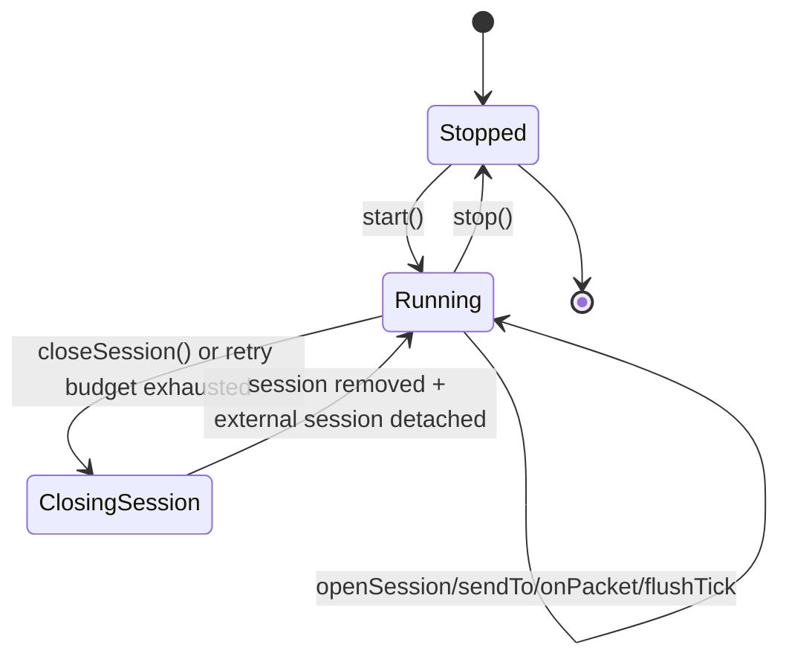

## Sequence Sketch: Impaired Reliable Delivery

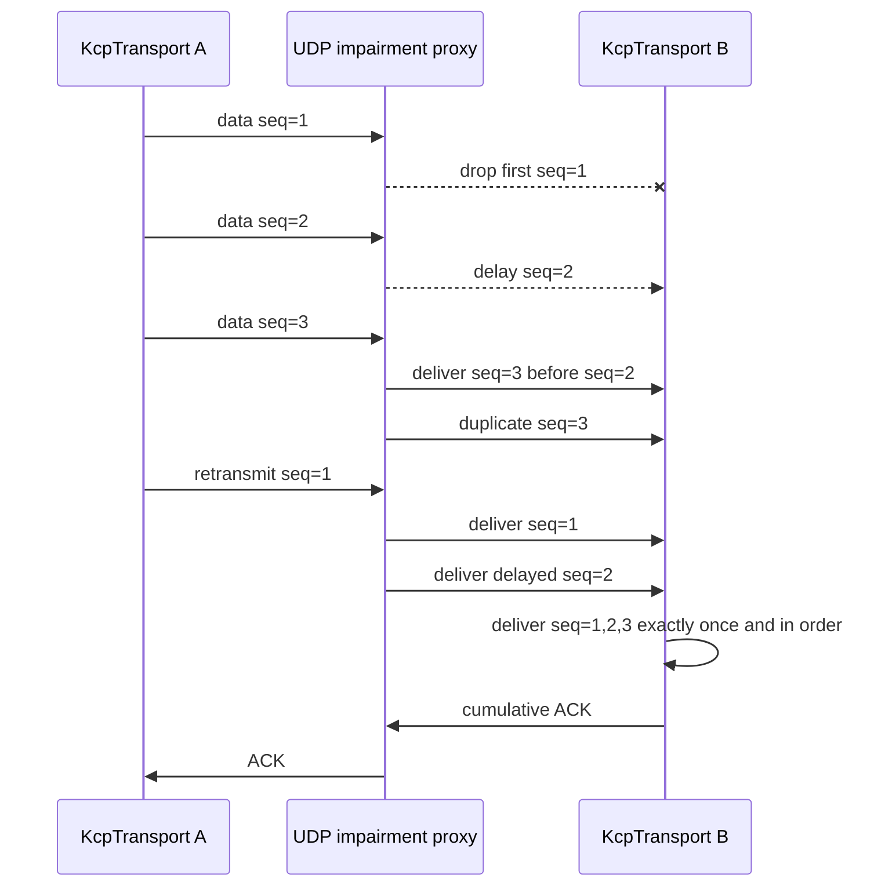

## Sequence Sketch: Redundant Copy Preview

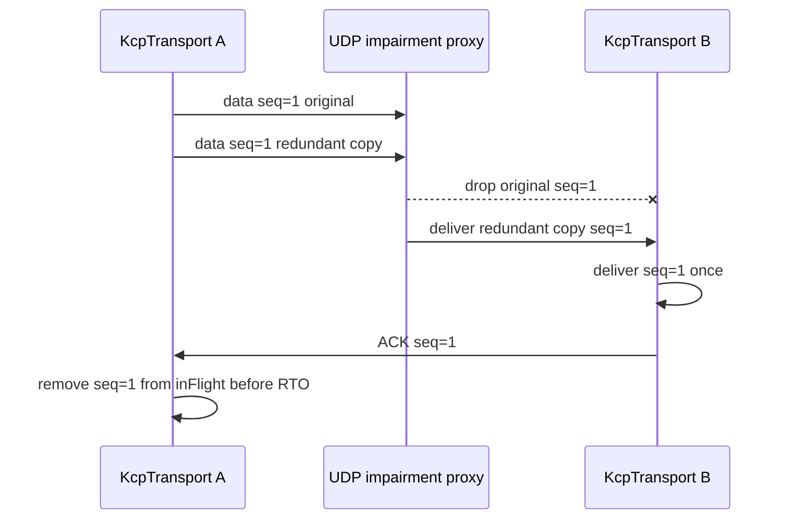

## Sequence Sketch: XOR Parity Recovery Preview

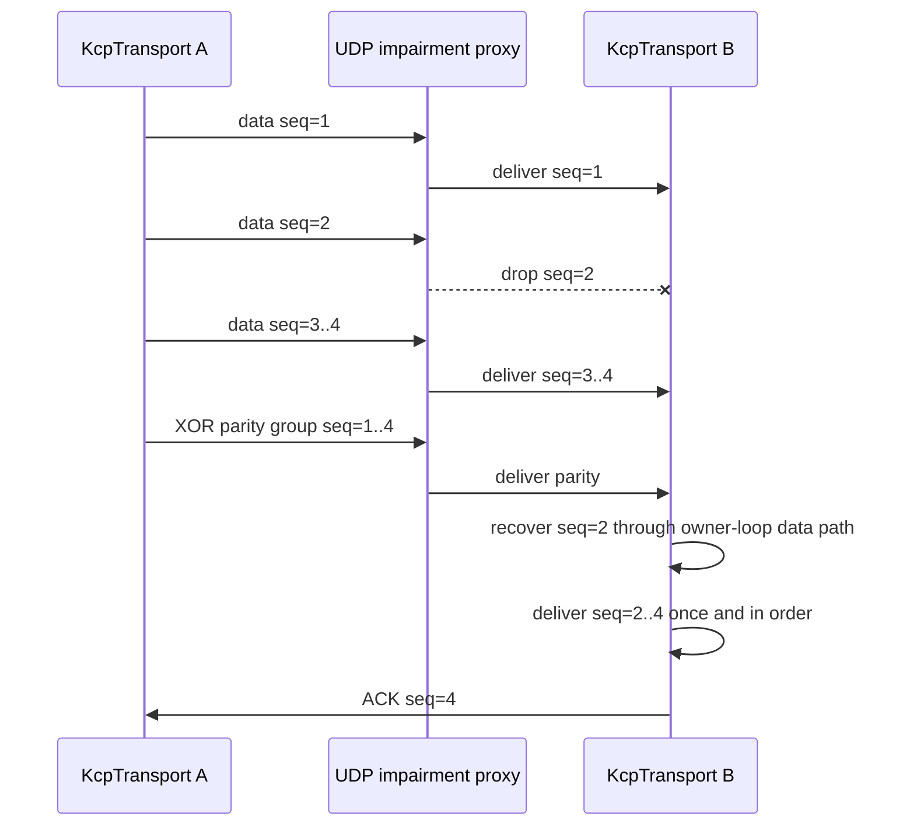

## Sequence Sketch: Congestion Window Preview

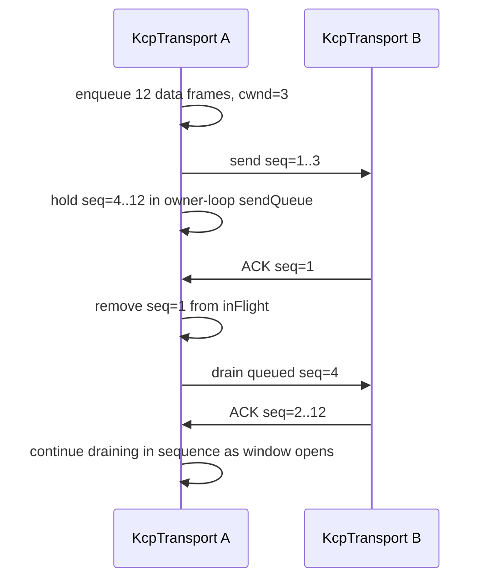

## Sequence Sketch: Dynamic MTU Probe Preview

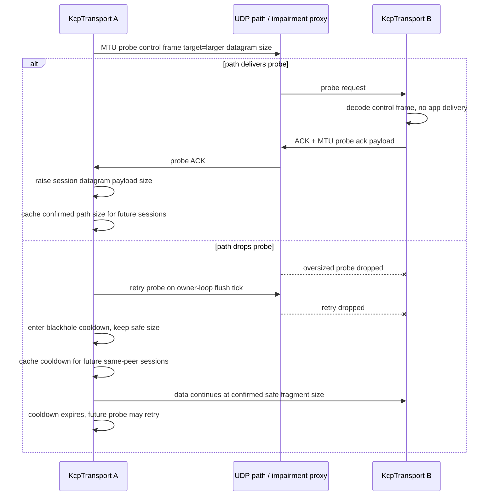

## Sequence Sketch: Path MTU Failure Signal Preview

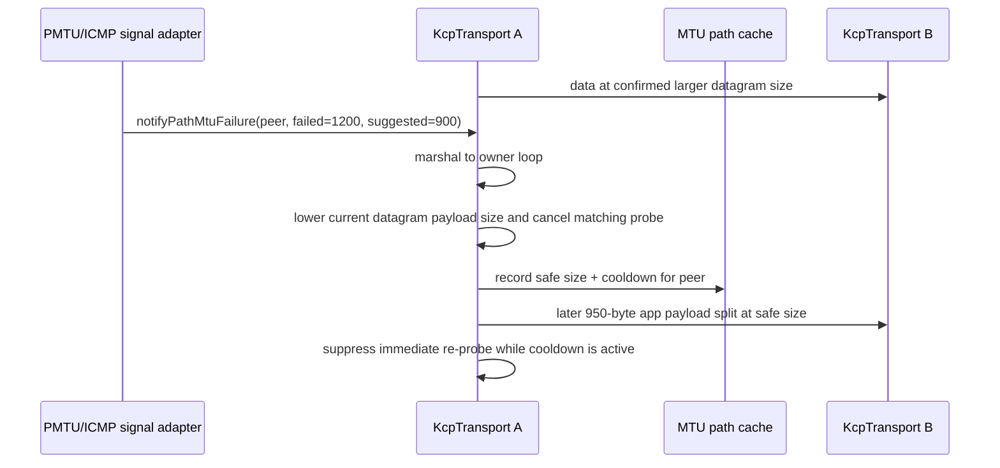

## Sequence Sketch: Linux Error Queue PMTU Signal Preview

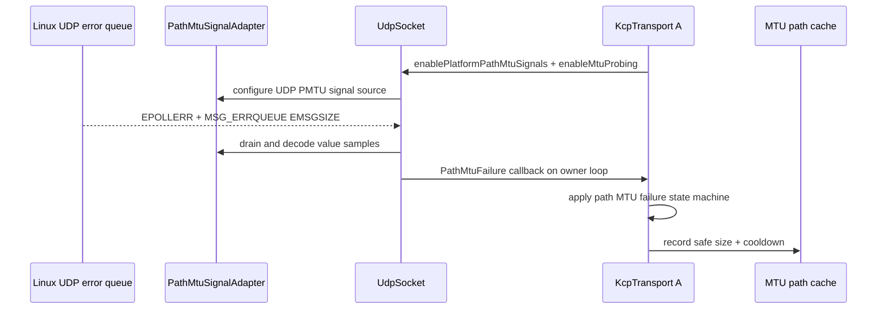

## Sequence Sketch: Raw ICMP PMTU Signal Preview

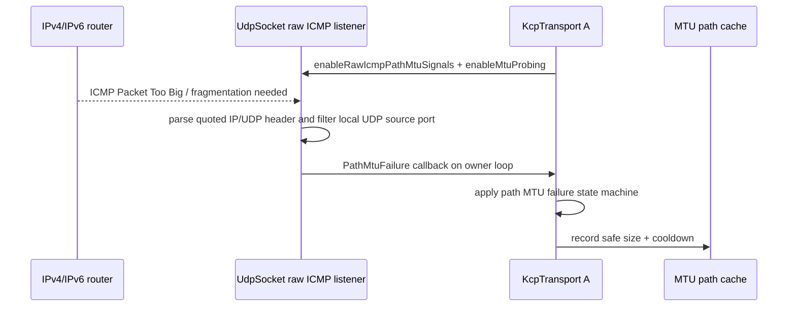

## Sequence Sketch: Authenticated Raw ICMP PMTU Signal Preview

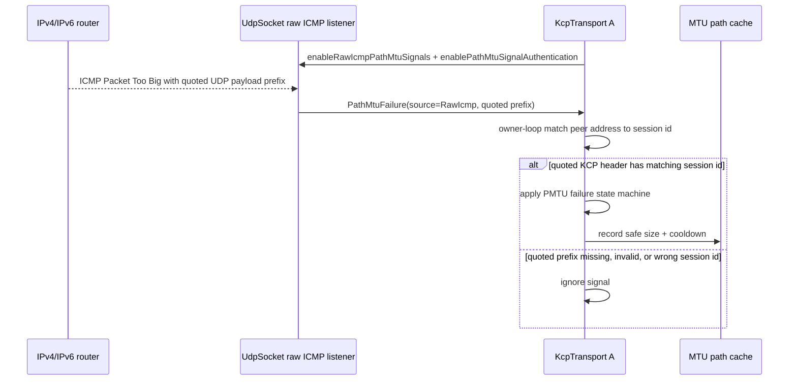

## Sequence Sketch: Shared Path MTU Cache Preview

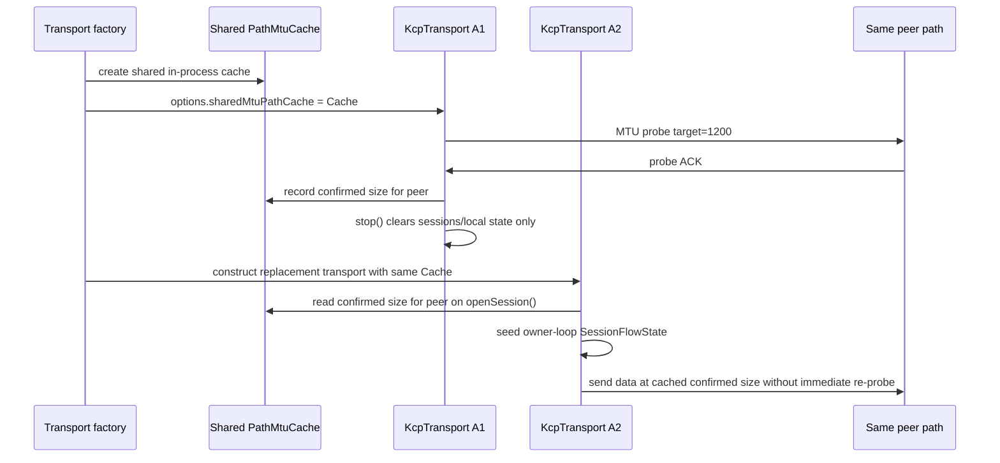

## Sequence Sketch: Selective ACK Gap

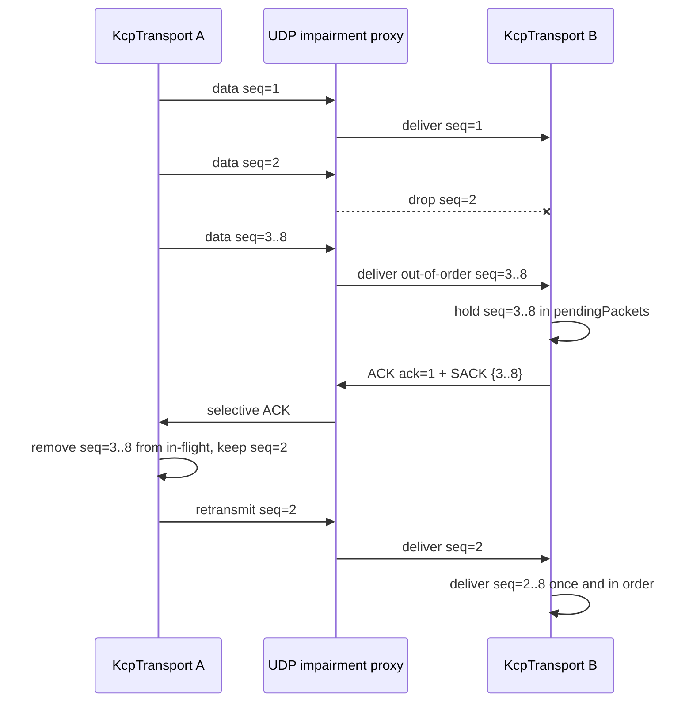

## Test Contracts

- `tests/unit/kcp/test_kcp_codec.cpp`
  - frame codec contract
  - 16-bit payload length boundary
  - selective ACK flag and payload preservation
  - MTU probe flag and control payload preservation
  - retry/RTO option normalization
  - congestion-window option normalization
  - redundant-copy option normalization
  - XOR parity flag/payload preservation
  - XOR parity option normalization
  - endpoint/session context
  - stop detach
  - cross-thread open session marshal
- `tests/contract/kcp/test_kcp_transport_stress_contract.cpp`
  - loss, reordering, duplicate packet, latency jitter recovery
  - fragmented large payload recovery under the same impairment proxy
  - periodic high-loss long-running stream recovery with tuned retry/RTO options
  - selective ACK suppresses retransmission for out-of-order received packets
  - dynamic MTU probe success allows larger single data frames
  - dynamic MTU probe failure keeps the prior safe fragment size
  - MTU blackhole cooldown suppresses immediate reprobe and preserves safe data delivery
  - MTU path cache reuses confirmed size and blackhole cooldown for reopened same-peer sessions
  - shared MTU path cache survives transport restart and seeds confirmed size / cooldown
    into a replacement transport
  - explicit path MTU failure signal downgrades cached size for current and reopened sessions
  - platform path MTU signal option is preserved and local UDP `EMSGSIZE` is translated by UdpSocket
  - UDP PMTU signal adapter keeps platform error queue handling outside KCP ownership
  - raw ICMP path MTU signal option is preserved for UDP-owned listener setup
  - authenticated raw ICMP PMTU signal rejects mismatched quoted KCP sessions
    and accepts a matching quoted session id
  - congestion window caps initial reliable data burst and drains on ACK
  - redundant copies cover first data loss without waiting for RTO
  - XOR parity recovers one lost data packet per group without waiting for RTO
  - ordered at-most-once delivery
  - stop/close/send concurrency safety
- `tests/integration/kcp/test_kcp_reliable_flow.cpp`
  - end-to-end reliable exchange
  - fragmented large payload roundtrip
  - retransmission timeout
  - retry count observation
  - stop-after-send drop path
- `tests/unit/udp/test_icmp_path_mtu_listener.cpp`
  - IPv4 ICMP and ICMPv6 Packet Too Big parsers extract peer address, failed
    UDP payload size, and suggested safe UDP payload size
  - parsers preserve raw ICMP source and bounded quoted UDP payload prefix
  - parser rejects wrong local UDP source port and non-Packet-Too-Big ICMP
- `tests/unit/udp/test_path_mtu_signal_adapter.cpp`
  - platform PMTU adapter UDP payload-size conversion
  - Linux error queue configure toggle or no-op fallback on unsupported platforms
  - platform capability reporting and connected-socket MTU query fallback
- `tests/unit/transport/test_path_mtu_cache.cpp`
  - shared path MTU cache value semantics and synchronization contract

## Review Checklist

- Which loop owns the socket, session map, flow state, and timer?
- Who owns sessions and who only observes transport?
- Which callbacks may re-enter send or close?
- Which operations are cross-thread and how are they marshaled?
- If raw ICMP PMTU authentication is enabled, which quoted KCP/session evidence
  is required before changing flow state?
- Which test proves loss/reorder/duplicate/jitter or lifecycle behavior?
